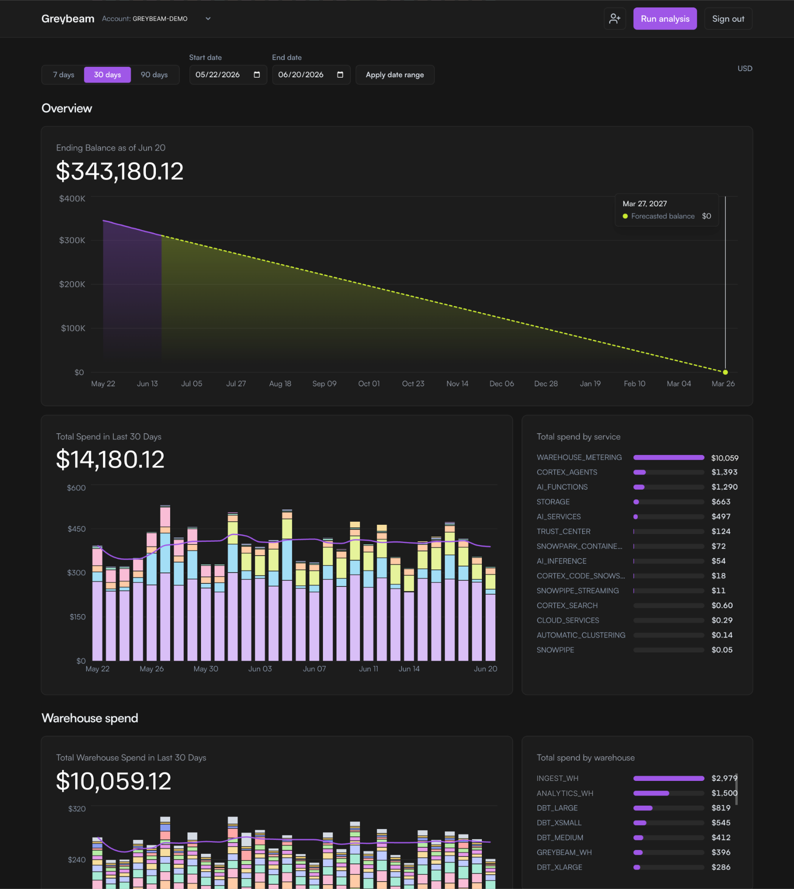

# Greysight

**An open source dashboard for Snowflake cost observability.**

[](LICENSE)

We're team Greybeam, we work with many Snowflake users who often have very narrow
visibility into their Snowflake costs. Many solely rely on the Cost Management tab
provided by Snowflake and that's obviously never enough.

Snowflake tells you what you spent. Finding out *where* it went usually means
writing your own queries against `ACCOUNT_USAGE` and `ORGANIZATION_USAGE` and
rebuilding the same charts every team builds. Greysight does that part for you:
it reads approved, read-only metadata queries, turns them into a cost dashboard,
and renders it in a Next.js app.

We offer a free hosted version at **[costs.greybeam.ai](https://costs.greybeam.ai)**.
In case you want more info before signing up you can find that [here](https://www.greybeam.ai/greysight).
Or run it yourself: using the quick start below.



## Quick start

You need Node.js 20+, npm, and [`uv`](https://docs.astral.sh/uv/) with Python 3.12.

## Run Greysight locally with a Snowflake account

Copy `.env.example` to `.env`, set
`DATA_SOURCE=snowflake`, keep `AUTH_REQUIRED=false`, and fill in your connection:

```bash
DATA_SOURCE=snowflake
AUTH_REQUIRED=false
NEXT_PUBLIC_API_BASE_URL=http://localhost:8000
SNOWFLAKE_ACCOUNT=
SNOWFLAKE_USER=
SNOWFLAKE_ROLE=
SNOWFLAKE_WAREHOUSE=
SNOWFLAKE_DATABASE=SNOWFLAKE
SNOWFLAKE_SCHEMA=ACCOUNT_USAGE
SNOWFLAKE_PRIVATE_KEY_PATH=/absolute/path/to/key.p8
SNOWFLAKE_PRIVATE_KEY_PASSPHRASE=
```

The role you authenticate with needs read access to the `ACCOUNT_USAGE` and
`ORGANIZATION_USAGE` views. Then restart `npm run dev`. Full walkthrough:
[docs/snowflake-setup.md](docs/snowflake-setup.md).

Greysight only ever runs the read-only SQL at [sql/snowflake](sql/snowflake)
and approved in [sql/dashboard_sources.yml](sql/dashboard_sources.yml). It does
not write to your account, and credentials never reach the browser.

## How it works

The data path is intentionally boring:

1. Read-only SQL lives in [sql/snowflake](sql/snowflake).
2. Each dataset is registered in [sql/dashboard_sources.yml](sql/dashboard_sources.yml).
3. FastAPI runs the approved sources (or loads demo data).
4. The backend computes the metrics and builds a prepared dashboard view.
5. The Next.js app fetches, validates, caches, and renders that view.

The frontend never invents its own analytics. If a chart needs a new derived
number, it gets added to the backend view contract first, so the dashboard and
the data always agree.

## Project layout

```text
apps/web/                Next.js dashboard, auth/org UI, browser API clients, tests
apps/api/                FastAPI backend, Snowflake access, metrics, route tests
sql/snowflake/           Approved read-only Snowflake SQL assets
sql/dashboard_sources.yml  Dataset registry for dashboard sources
supabase/migrations/     Schema, RLS, org membership, credential storage
docs/                    Setup, Snowflake, security, and deployment notes
```

## Development

From the repository root:

```bash
npm run dev          # web :3000 + API :8000
npm run test         # Vitest + pytest
npm run lint         # ESLint + ruff
npm run typecheck    # TypeScript
```

The test suites are hermetic, they never call Snowflake or Supabase, and demo
mode stays fully local, so you can work on the dashboard without any external
credentials.

## Docs

- [Local development](docs/local-development.md)
- [Snowflake setup](docs/snowflake-setup.md)
- [Security model](docs/security-model.md)
- [Deployment](docs/deployment.md)
- [Dependency compatibility](docs/dependency-compatibility.md)

## Contributing

Greysight is young and `0.0.1` is intentionally narrow — it's a cost dashboard,
not a recommendations engine (yet). Small, focused changes are easiest to review.

A typical dashboard change touches the SQL source or backend metric, the prepared
view contract, the frontend view, the demo data, and tests. Keep analytics in the
backend and presentation in the frontend, keep secrets out of the browser, and
let Supabase own auth while the backend owns authorization and Snowflake access.

## License

[Apache-2.0](LICENSE).
